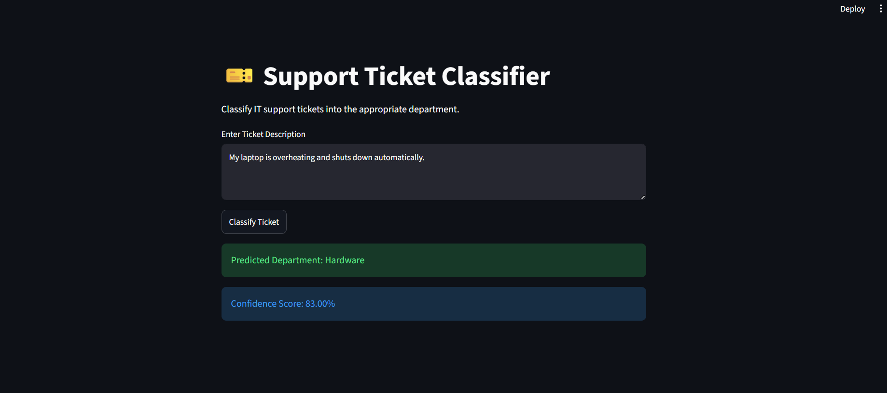

# 🎫 Support Ticket Classification System

## 📌 Project Overview

This project is an NLP-based Support Ticket Classification System that automatically categorizes IT support tickets into the appropriate department.

The system uses TF-IDF feature extraction and Logistic Regression to classify incoming support requests into one of eight categories.

The application is deployed using Streamlit and provides real-time predictions with confidence scores.

---

## 🎯 Problem Statement

Organizations receive thousands of support tickets every day. Manually routing these tickets to the correct department can be time-consuming and inefficient.

This project automates the ticket classification process, helping support teams improve response times and operational efficiency.

---

## 📊 Dataset

Dataset: IT Service Ticket Classification Dataset

Total Records: 47,837

Classes:

* Hardware
* Access
* HR Support
* Purchase
* Storage
* Administrative Rights
* Internal Project
* Miscellaneous

---

## 🛠️ Technologies Used

* Python
* Pandas
* Scikit-learn
* TF-IDF Vectorization
* Logistic Regression
* Streamlit
* Joblib

---

## ⚙️ Machine Learning Pipeline

Support Ticket Text
→ Text Preprocessing
→ TF-IDF Vectorization
→ Logistic Regression
→ Department Prediction

---

## 📈 Model Performance

| Model               | Accuracy |
| ------------------- | -------- |
| Logistic Regression | 84.86%   |
| Random Forest       | 83.59%   |
| Naive Bayes         | 74.32%   |

Selected Model: Logistic Regression

Final Accuracy: 84.86%

---

## 🚀 Features

* Automated ticket classification
* Real-time predictions
* Confidence score display
* Streamlit web application
* Model comparison and evaluation

---

## 👨‍💻 Author

Aprameya Haritasa Sharma K L

LinkedIn:
linkedin.com/in/aprameyakl05

## Application Screenshots

## Dashboard
